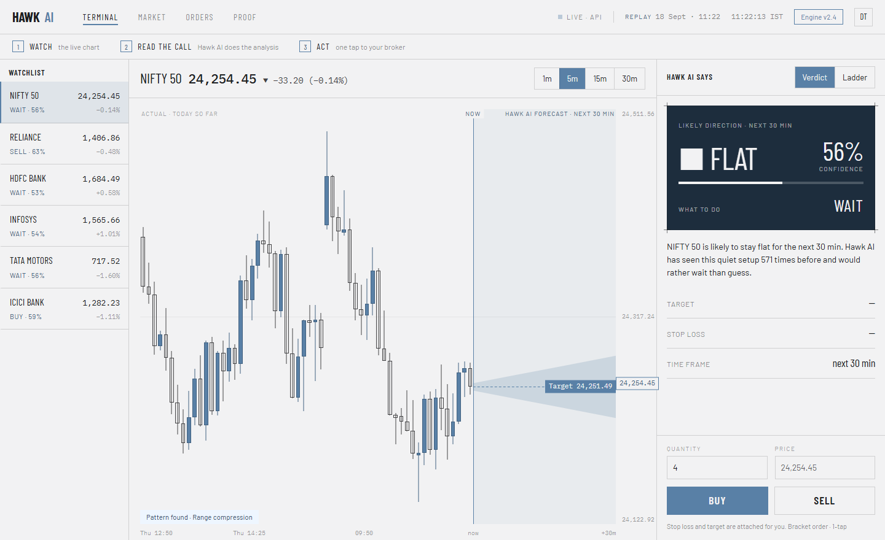
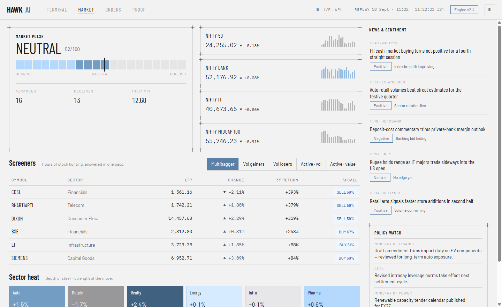
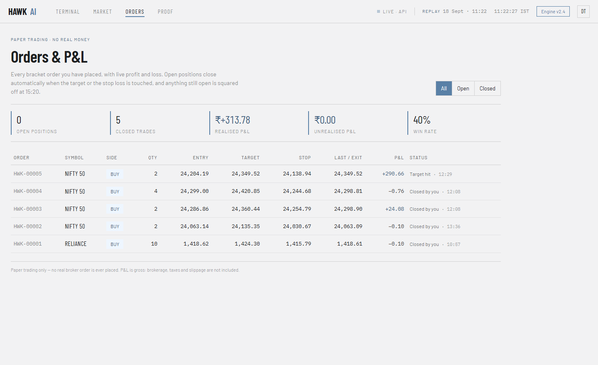
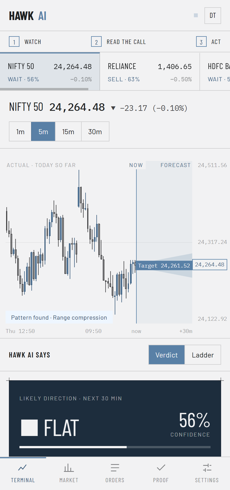

# Hawk AI

**An AI-assisted intraday trading terminal for Indian markets (NSE).**

Watch a live chart, read a probability-based call — *"DOWN 59% over the next 30 minutes"* — and act in
one tap with a bracket order that has its target and stop loss already attached.

Final-year IT engineering major project (2026–27), sponsored by SNP Innovation Pvt. Ltd.

> ### Paper trading only
> No real broker order is ever placed and no real money is involved. Hawk AI gives
> probability-based guidance, not investment advice.



---

## Honest status

This is a working system, but not every part of it is finished. To be clear about what is real today:

| Part | Status |
|---|---|
| Terminal, Market, Orders, Proof, Login, Settings screens | **Working** |
| Paper trading engine — bracket orders, target/stop, 15:20 square-off, P&L | **Working** |
| Accounts — registration, login, JWT sessions | **Working** |
| Market data | **Replayed, not live.** Runs on generated sample data until the Kaggle NSE files are loaded |
| The prediction model | **Placeholder.** `sample-momentum-v0` is a momentum rule, not a trained model |
| Backtest figures on the Proof screen | **Illustrative placeholders.** The screen says so until a real backtest replaces them |

The placeholder banner on the Proof screen is driven by the backend's actual predictor, so it
disappears by itself once a trained model is serving. Nothing here presents invented numbers as
measured results.

---

## The screens

| | |
|---|---|
| **Terminal** — watchlist, candle chart with the forecast cone, the AI call in Verdict or Ladder form, and a one-tap order ticket | **Market** — market pulse and breadth, index cards, five screeners, sector heat, news and policy |
|  |  |
| **Orders** — every paper order with live P&L, a portfolio summary and a Close button | **Responsive** — a phone layout with a bottom tab bar and a scrolling watchlist strip |
|  |  |

---

## How the market data works

Hawk AI **replays** a past trading day as if it were today, so the chart always moves — even at
night, and even on a weekend when you are demoing it.

- `REPLAY_CLOCK=live` walks through the 09:15–15:30 session in step with the real clock and loops
  all day.
- `REPLAY_CLOCK=14:00` freezes the market at a fixed time, which is useful for screenshots and tests.

The header shows which day is being replayed and where its clock has reached, so the screen is never
pretending to be live.

With no data prepared, the backend generates realistic **sample** data on first run — that is what
the screenshots above show. Load the real NSE 1-minute files to replace it (see
[the backend README](hawk-ai-backend/README.md#3-load-the-real-kaggle-data)).

---

## Run it locally

You need **Python 3.10+** and **Node.js 20.19+ or 22.12+**.

### 1. Backend

```powershell
cd hawk-ai-backend
```
```powershell
python -m venv .venv
```
```powershell
.venv\Scripts\Activate.ps1
```
```powershell
pip install -r requirements.txt
```
```powershell
uvicorn app.main:app --reload
```

The API is now on **http://localhost:8000**, with interactive docs at **/docs**.
It generates sample data on the first run, so there is nothing to download first.

> On macOS or Linux use `source .venv/bin/activate` instead.
> If PowerShell blocks `Activate.ps1`, run `Set-ExecutionPolicy -Scope CurrentUser RemoteSigned` once.

### 2. Frontend

In a second terminal:

```powershell
cd hawk-ai-frontend
```
```powershell
npm install
```
```powershell
npm run dev
```

Open **http://localhost:5173** and sign in with the demo account:

```
demo@hawk.ai  /  hawk1234
```

The frontend reads `VITE_API_URL` from `hawk-ai-frontend/.env`. Leave it empty and the app runs on
built-in sample data with no backend at all; set it to `http://localhost:8000` and the header
switches to **Live · API**.

---

## Architecture

```
HAWK-AI/
├── hawk-ai-frontend/   React 19 + Vite 7, plain JavaScript, react-router-dom 7
│                       No chart library — the candles and forecast cone are divs + SVG
└── hawk-ai-backend/    Python 3.10+, FastAPI, pandas, SQLite, PyJWT
```

Two rules hold the codebase together:

1. **`src/api/index.js` is the only place the UI gets data.** No component calls `fetch()`. That one
   seam is what lets the whole app run on either the FastAPI server or local mock data.
2. **The backend speaks the frontend's language.** Python stays `snake_case`; JSON goes out
   `camelCase` through Pydantic alias generators, so neither side has to translate.

The prediction engine sits behind a `Predictor` protocol (`app/ml/base.py`), so swapping the
placeholder for a trained model is a config change — `PREDICTOR=model` — not a rewrite.

Each half has its own README with full setup steps and the complete API contract:
**[frontend](hawk-ai-frontend/README.md)** · **[backend](hawk-ai-backend/README.md)**

---

## Tests

```powershell
cd hawk-ai-backend
```
```powershell
pip install -r requirements-dev.txt
```
```powershell
pytest -q
```

```powershell
cd hawk-ai-frontend
```
```powershell
npm run build
```

---

## Roadmap

- [x] Terminal, Market and Proof screens
- [x] Paper trading engine with bracket orders and P&L
- [x] Accounts and JWT sessions
- [x] Orders & P&L screen
- [ ] Load the real Kaggle NSE minute data
- [ ] Train and integrate the prediction model, and publish a real backtest
- [ ] Deploy — frontend on Vercel, backend on Render or Railway
- [ ] Live data via the Upstox API

---

## Deploying

Two settings matter before this goes anywhere public:

- **`JWT_SECRET`** — set a long random string. Without it the backend generates one into
  `data/.jwt_secret`, which is lost on every restart on an ephemeral disk, signing everyone out.
- **`SEED_DEMO_USER=false`** — it defaults to `true` for local convenience, which means a deployed
  instance would otherwise ship with the published demo credentials above.

Also note SQLite lives on local disk, so accounts and orders reset whenever the host does.

---

## Licence and disclaimer

Academic project, not financial software. All figures on the Proof screen are illustrative until a
real backtest replaces them. Trading carries risk; nothing here is investment advice.
